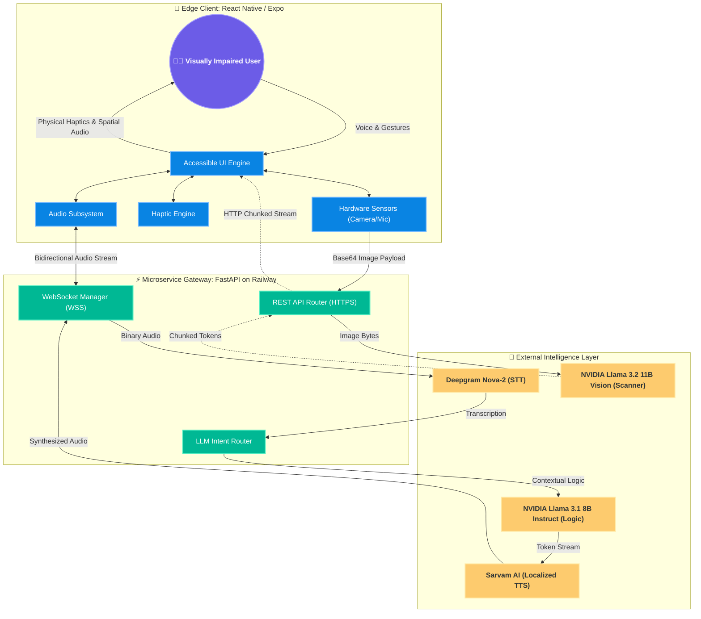

# EchoVision: Enterprise System Architecture & Optimization Overview

**Author:** Akash Kumar  
**Application:** EchoVision Accessibility Platform  
**Version:** 1.0.0 (Production)  
**Classification:** Internal Architecture Documentation  

---

## 1. Executive Summary
EchoVision is an ultra-low-latency, real-time accessibility platform engineered specifically for visually impaired users. It seamlessly merges computer vision, conversational AI, and spatial audio to provide instant environmental awareness. 

The core architectural philosophy is driven by **three pillars**:
1. **Zero-Friction Accessibility:** Relying entirely on native haptics, edge gestures, and auditory feedback rather than visual UI components.
2. **Sub-Second Latency (TTFAB):** Optimizing the Time-To-First-Audio-Byte through asynchronous chunked streaming and bidirectional WebSockets.
3. **Stateless Scalability:** Utilizing a decoupled FastAPI backend to scale infinitely alongside third-party AI compute clusters.

---

## 2. High-Level System Architecture

The following diagram illustrates the boundary between the Edge Client (React Native), the Gateway API (FastAPI), and the External Intelligence Layer.

---

## 3. Technology Stack & Component Breakdown

### 3.1 Edge Client Layer
Built on **React Native (Expo SDK 54) + TypeScript**, focusing on bare-metal hardware access:
- **Audio Capture (`expo-av`):** Streams linear16 raw audio bytes directly to the backend for real-time processing.
- **Vision Capture (`expo-camera`):** Captures high-res frames for the Scene Scanner.
- **Physical Feedback (`expo-haptics`):** Translates digital states (loading, success, error) into physical vibrations, crucial for blind users.
- **Offline Resilience (`expo-network`):** Actively polls connection state to verbally warn the user of connectivity loss using the native OS synthesizer (`expo-speech`).

### 3.2 Application Gateway (Backend)
Built on **Python 3.11 + FastAPI**, deployed as a containerized Nixpacks application on the Railway Cloud:
- **Asynchronous Core:** Uvicorn ASGI server heavily utilizes `asyncio` and `async def` endpoints, allowing a single lightweight server instance to handle thousands of concurrent I/O-bound WebSocket connections without blocking the main thread.
- **Intent Routing:** A semantic routing layer that intercepts transcribed text and classifies it (Scene Scanner, Text Reader, SOS, or Conversational) in milliseconds.

### 3.3 External Intelligence Layer
- **Deepgram (Nova-2):** Industry-leading STT optimized for real-time WebSocket transcription.
- **NVIDIA NIM (Llama 3.1 8B Instruct):** Serves as the central "Brain". The 8B parameter footprint guarantees lightning-fast token generation compared to heavier 70B models, drastically reducing latency.
- **NVIDIA NIM (Llama 3.2 11B Vision Instruct):** Handles complex optical character recognition (OCR) and deep scene analysis.
- **Sarvam AI:** Provides ultra-realistic, culturally localized Hindi and Hinglish Text-to-Speech synthesis.

---

## 4. Latency Optimization Strategies

To achieve a "conversational" feel, EchoVision eliminates traditional REST API bottlenecks through hyper-optimized streaming pipelines.

### 4.1 Time-To-First-Audio-Byte (TTFAB) Pipeline
Traditional AI voice assistants suffer from high latency due to sequential processing. EchoVision utilizes a **Chunked Yield Architecture**:
1. The user speaks, and Deepgram transcribes the audio *as it is being spoken*.
2. The transcription is instantly fed to **Llama 3.1 8B**.
3. Instead of waiting for the full response, the backend intercepts the text stream. The exact millisecond Llama generates a logical sentence break (e.g., a period, comma, or newline), that specific chunk is detached and sent asynchronously to **Sarvam TTS**.
4. The synthesized audio chunk is piped down the WebSocket to the user's phone and immediately played.
5. **Result:** The user hears the AI begin speaking in **< 1.5 seconds**, while the AI continues to secretly generate the remainder of the response in the background.

### 4.2 HTTP/2 Chunked Transfer Encoding (Vision)
Vision models inherently suffer from high latency due to massive parameter counts. To prevent "dead air" for the user:
- The backend utilizes FastAPI's `StreamingResponse`.
- As the **Llama 3.2 11B Vision** model inspects the image, it streams descriptions word-by-word.
- The React Native client intercepts this stream and feeds it into the native OS text-to-speech engine in real-time, providing the blind user with immediate, rolling auditory feedback.

---

## 5. Security & Reliability

- **Stateless Infrastructure:** The backend stores no conversational history in local memory or disks. All context is transient, ensuring high privacy for the user and allowing the backend containers to scale horizontally with zero friction.
- **Graceful Degradation:** If an external AI provider experiences an outage, the system immediately falls back to localized error handling, utilizing `expo-speech` and distinct haptic error patterns to notify the user without crashing the application.
- **Environment Isolation:** All sensitive API keys (NVIDIA, Deepgram, Sarvam) are strictly injected at runtime via secure Railway Environment Variables.

---

## 6. Future Extensibility Map
1. **Edge AI Processing:** Migrating the STT (Speech-to-Text) models directly to the local device using React Native native modules to completely eliminate network dependency for transcriptions.
2. **WebRTC Integration:** Upgrading from raw WebSockets to WebRTC to handle variable network conditions (packet loss, jitter) more effectively over cellular data.
