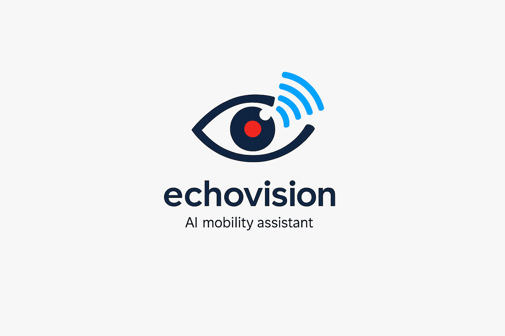

<table style="border: none; border-collapse: collapse; width: 100%;">
  <tr style="border: none;">
    <td align="left" valign="top" style="border: none; width: 180px;">
      
    </td>
    <td align="right" valign="middle" style="border: none;">
      <h1>EchoVision</h1>
      <p><b>An AI-Powered Conversational App for the Visually Impaired</b></p>
      <p>
        
        <a href="https://reactnative.dev/"></a>
        <a href="https://expo.dev/"></a>
        <a href="https://nodejs.org/"></a>
        <a href="https://fastapi.tiangolo.com/"></a>
        <a href="https://www.python.org/"></a>
        <br/>
        <a href="https://build.nvidia.com/"></a>
        <a href="https://deepgram.com/"></a>
        <a href="https://www.sarvam.ai/"></a>
        <a href="https://firebase.google.com/"></a>
        <a href="https://redis.io/"></a>
        <a href="https://opensource.org/licenses/MIT"></a>
      </p>
    </td>
  </tr>
</table>

## ✨ Overview

EchoVision is a fully voice-driven, cross-platform mobile application designed specifically for the visually impaired. It breaks the barrier of traditional touch interfaces by allowing users to navigate, identify objects, read text, and request emergency assistance entirely via an always-listening conversational AI assistant.

With a blazing-fast hybrid architecture, EchoVision marries the power of on-device contextual routing with heavy cloud-based LLM logic, Deepgram Speech-to-Text (STT), and Sarvam AI Text-to-Speech (TTS) for natural, low-latency, and culturally localized Indian voice synthesis.

## 🚀 Key Features

- **🗣️ Always-On Voice Assistant**: Wake the assistant instantly using hardware volume keys. No screen tapping required.
- **📸 Scene Scanner**: Leverages NVIDIA's Llama 3.2 11B Vision Instruct to describe the user's surroundings in high detail.
- **📖 Text Reader**: OCR capabilities integrated to read documents, signs, and labels aloud.
- **🗺️ Intelligent Navigation**: Contextual OSRM routing calculates distances and travel time to specific places before effortlessly handing off to Google Maps or Apple Maps for turn-by-turn navigation.
- **🚨 Emergency SOS**: Instantly trigger SOS alerts via voice commands to notify trusted contacts.
- **🇮🇳 Multi-Lingual & Conversational**: Built-in support for English, Hindi, and Hinglish with zero-latency fallback routing for local commands (like toggling haptics or the flashlight).

## 🏗️ Architecture

EchoVision relies on a distributed Client-Server architecture to maintain battery life on the device while pushing heavy ML workloads to the cloud.

```text
+---------------------------------------------------------+
|              MOBILE CLIENT (React Native)               |
|                                                         |
|  [Hardware Volume Keys] --> [VoiceContext Engine]       |
|                                   |                     |
|              +--------------------+------------------+  |
|              |                                       |  |
|      [Local Fallbacks]                       [Microphone]
|      - Flashlight / SOS                          |      |
|                                                  |      |
|       [Audio Speaker] <--------------------+     |      |
+--------------------------------------------|-----|------+
                                             |     |
                             Streamed Audio  |     | Audio Blob
                                             |     |
+--------------------------------------------|-----|------+
|                CLOUD SERVER (FastAPI)      |     |      |
|                                            |     v      |
|                              +------ [Deepgram STT]     |
|                              |                          |
|    [NVIDIA Llama 3.2 Vision] |       (Transcribed Text) |
|    [NVIDIA Llama 3.1 8B] <---+                          |
|                              |       (Action + Text)    |
|                              +-----> [Sarvam AI TTS]    |
+---------------------------------------------------------+
```

### Tech Stack

| Layer | Technology | Purpose |
| ------| ---------- | ------- |
| **Frontend** | React Native, Expo | Cross-platform mobile client, hardware access (camera, haptics, volume keys), UI. |
| **Backend** | Python, FastAPI | High-concurrency REST APIs connecting the mobile client to heavy AI endpoints. |
| **STT** | Deepgram | Ultra-fast speech-to-text capable of handling Hindi and English interchangeably. |
| **TTS** | Sarvam AI | Generates high-quality, emotionally resonant Indian voice synthesis. |
| **LLM Engine** | NVIDIA NIMs | `Llama 3.1 8B` for sub-second intent classification and conversational responses. `Llama 3.2 11B Vision` for Scene Scanning. |
| **Caching** | Redis | Caches TTS payloads and frequent intents to achieve <50ms turnaround for common queries. |
| **Auth/DB** | Firebase | Secure user authentication and application data. |

## 🛠️ Getting Started

### Prerequisites

- Node.js (v18+)
- Python (v3.10+)
- `uv` (Fast Python package installer)
- Expo Go (or iOS Simulator / Android Studio)

### 1. Clone the repository

```bash
git clone https://github.com/yourusername/echovision.git
cd echovision
```

### 2. Backend Setup

```bash
cd backend
# Create and activate a virtual environment (using uv or venv)
uv venv
source .venv/bin/activate # Or .venv\Scripts\activate on Windows

# Install dependencies
uv pip install -r pyproject.toml

# Set up your environment variables
cp .env.example .env
# Edit .env and add your Deepgram, Sarvam, and NVIDIA API keys.
# Add your Firebase serviceAccountKey.json to the backend root.

# Run the backend
uv run uvicorn app.main:app --host 0.0.0.0 --port 8000 --reload
```

### 3. Frontend Setup

```bash
cd ../frontend

# Install dependencies
npm install

# Run the Expo development server
npx expo start -c
```

### 4. Running the App
Scan the QR code printed by Expo using the **Expo Go** app on your physical device. Ensure your phone and development machine are on the same Wi-Fi network.

## 🛡️ Security & Privacy

EchoVision respects user privacy. Audio data is transmitted securely to the backend for processing and is NOT permanently stored. 

Sensitive keys (like `serviceAccountKey.json`, `google-services.json`, and `.env` files) are explicitly hidden from source control using rigorous `.gitignore` rules.

## 📄 License

This project is licensed under the MIT License - see the LICENSE file for details.

<div align="center">
<i>Built with ❤️ to make the world more accessible.</i>
</div>
